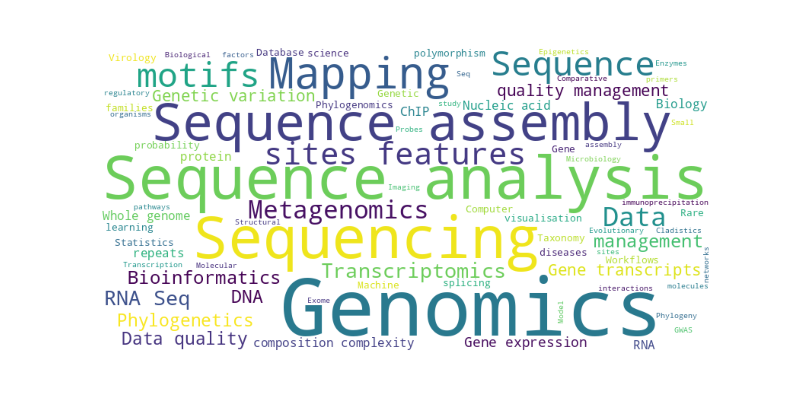
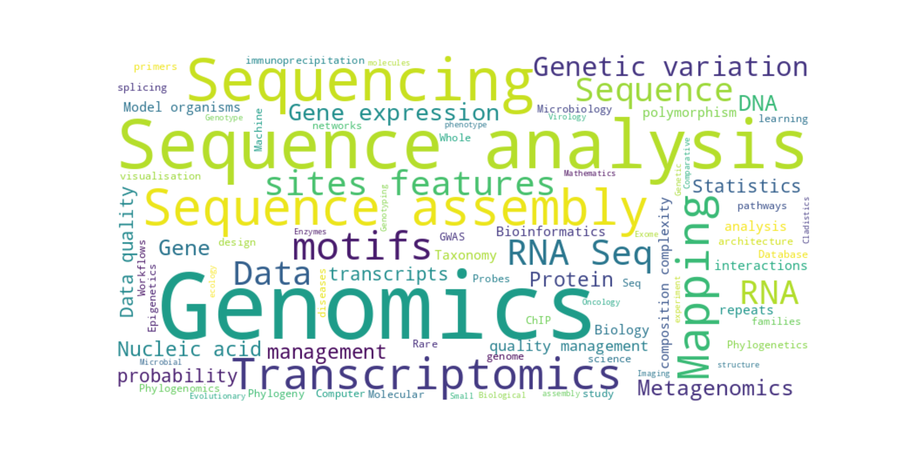

User Guide
==========

.. contents:: Table of Contents

Getting help
-------------

The **Damona** command-line tool is called ``damona``.  Every command exposes
its own ``--help`` flag::

    damona --help

Commands are grouped by theme in the ``--help`` output:

.. code-block:: text

    Environment management
      create      Create a new environment
      remove      Remove an environment and all its binaries
      rename      Rename an existing environment
      env         List all environments with their size and binary counts
      activate    Activate a Damona environment
      deactivate  Deactivate the current Damona environment

    Package management
      install     Download and install an image and its binaries
      uninstall   Uninstall a binary or an image from an environment
      clean       Find and remove orphaned images and binaries
      export      Export an environment as a YAML file or a tar bundle
      info        Show images and binaries installed in an environment

    Registry
      search      Search the registry for a container image or binary
      list        List all containers available in the local registry
      stats       Show registry statistics and local installation summary

    Developer tools
      check       Check that all binaries in a built image are functional
      build       Build a Singularity image from a recipe or a Docker image
      catalog     Show latest version, size, and base image for every container

.. warning:: ``remove`` deletes a whole **environment**; to drop a single
   binary or image use ``uninstall``.

The *Developer tools* commands are aimed at container authors and are covered
in the :ref:`developer guide <dev-guide>`.

For detailed help on any sub-command, append ``--help``::

    damona install --help

Environments
------------

An *environment* in Damona is simply a directory under
``~/.config/damona/envs/`` that contains a ``bin/`` sub-directory.
When an environment is *activated*, its ``bin/`` path is prepended to your
``PATH``, making all installed software immediately available.  All
Singularity images are shared between environments to avoid duplicating large
files on disk.

List environments
~~~~~~~~~~~~~~~~~

Show all environments on the system::

    damona env

When starting fresh, you will see only the **base** environment.  The **base**
environment is reserved and cannot be deleted, but you can install software
into it freely.

Create an environment
~~~~~~~~~~~~~~~~~~~~~

Create a new environment called ``TEST``::

    damona create TEST

All environments are created under ``~/.config/damona/envs/``.  After
creation, run ``damona env`` again to confirm it appears in the list.

An environment can also be re-created from a previous export (see
:ref:`export`)::

    damona create TEST --from-yaml damona_TEST.yaml
    damona create TEST --from-bundle damona_TEST.tar

Rename or delete an environment::

    damona rename TEST --new-name PROD
    damona remove PROD

.. warning:: ``damona remove`` deletes the environment and every wrapper it
   contains.  Add ``--force`` to skip the confirmation prompt.  The shared
   images themselves are kept; use ``damona clean`` to reclaim that space.

Activate and deactivate environments
~~~~~~~~~~~~~~~~~~~~~~~~~~~~~~~~~~~~~

Activating an environment appends its ``bin/`` directory to your ``PATH``.
Any software installed in that environment then becomes available directly
from the command line::

    damona activate TEST

Verify the active environment::

    damona env

The last line should read::

    Your current env is 'TEST'.

Deactivate when you are done::

    damona deactivate TEST

Environments behave as a **Last-In-First-Out** stack: calling ``deactivate``
without an argument always removes the most recently activated environment::

    damona activate base
    damona activate TEST
    damona deactivate        # removes TEST, base remains active

To deactivate a specific environment by name::

    damona activate base
    damona activate TEST
    damona deactivate base   # removes base, TEST remains active

Software and releases
---------------------

Search for available software
~~~~~~~~~~~~~~~~~~~~~~~~~~~~~~

**Damona** ships with a built-in registry of container recipes.  To list all
available images::

   damona search "*" --images-only

Each result shows the container name, its version, and where the image will be
downloaded from.

Search for a specific tool by name::

    damona search fastqc

**Third-party registries** – Anyone can publish containers on the web and
provide a ``registry.txt`` index file.  Point Damona at that file to search
it::

    damona search "*" --registry https://biomics.pasteur.fr/salsa/damona/registry.txt

The above URL has a predefined alias called ``damona`` in the default
configuration, so this shorter form is equivalent::

    damona search "*" --registry damona

You can add your own aliases in ``~/.config/damona/damona.cfg`` (see the
:ref:`configuration section <dev-config>` in the developer guide).

To ignore the online registry altogether and use only the copy bundled with
your installation (no network access required)::

    damona search fastqc --local-registry-only

Scientific scope of the registry
~~~~~~~~~~~~~~~~~~~~~~~~~~~~~~~~~

The following tag clouds give a rough idea of the topics and operations
covered by the containers currently shipped with Damona.  They are built from
the `bio.tools <https://bio.tools>`_ annotations of every registered tool and
binary (see ``doc/build_word_cloud.py`` to regenerate them).

Topics and operations of the registered **tools**:

Same analysis at the level of individual **binaries**:

Download and install a container
~~~~~~~~~~~~~~~~~~~~~~~~~~~~~~~~~

Before installing, activate the environment where you want the software to
live::

    damona activate TEST

Then install the desired container.  Specify an exact version with a colon
separator::

    damona install fastqc:0.11.9

To install the latest available version, omit the tag::

    damona install fastqc

The image is saved to ``~/.config/damona/images/`` and a thin shell-wrapper
binary is created in the active environment's ``bin/`` directory.  The wrapper
looks like::

    #!/bin/sh
    singularity -s exec ${DAMONA_SINGULARITY_OPTIONS} \
        ${DAMONA_PATH}/images/fastqc_0.11.9.img fastqc ${1+"$@"}

After installation the command is immediately available::

    fastqc --version

.. note:: The ``PATH`` change made by ``damona activate`` applies to the
   **current** shell session only.  Open a new terminal and re-activate the
   environment when needed.

Install from an external registry::

    damona install fastqc:0.11.9 --registry https://biomics.pasteur.fr/drylab/damona/registry.txt

Or use the short alias::

    damona install fastqc:0.11.9 --registry damona

Working with multiple environments
------------------------------------

Damona stores everything under ``~/.config/damona/``:

* ``envs/`` – one sub-directory per environment, each containing a ``bin/``
  folder with wrapper scripts
* ``images/`` – Singularity image files shared across all environments

To test two versions of the same tool side-by-side::

    # Create and populate the first environment
    damona create test1
    damona activate test1
    damona install fastqc:0.11.9

    # Switch to the second environment
    damona deactivate
    damona create test2
    damona activate test2
    damona install fastqc:0.11.8 --registry damona

Both environments now contain their own ``fastqc`` wrapper pointing to the
appropriate image.  Only **one** copy of each image is stored on disk.

Install binaries not listed in the registry
--------------------------------------------

When a container developer registers a tool they list the binaries that should
be installed.  Occasionally a container ships additional executables that are
not yet in the registry.  If you know the binary name, you can install it
directly::

    damona install mummer --binaries show-snps

This creates a wrapper for ``show-snps`` using the ``mummer`` container without
waiting for an official registry update.  If this helps you please consider
opening an issue or a pull request so the registry can be updated for
everyone.

Several binaries can be requested at once with a comma-separated list::

    damona install mummer --binaries show-snps,show-coords

Inspect an environment
----------------------

List the images and binaries installed in an environment::

    damona info TEST

The whole local registry (every container Damona knows about) is printed by::

    damona list

Summary statistics — number of containers, versions, unique binaries, and how
much disk space the locally installed images take::

    damona stats

Uninstall software
------------------

To remove a single binary or an image from an environment, use ``uninstall``
(not ``remove``, which deletes the whole environment)::

    damona uninstall fastqc

By default the currently active environment is targeted.  Choose another one
explicitly::

    damona uninstall fastqc --environment TEST

Over time, deleting binaries by hand may leave images behind that no
environment references any more (or, conversely, wrappers pointing at images
that no longer exist).  Both kinds of orphans are reported by::

    damona clean

This is a dry-run by default and only prints what it would do.  Add
``--do-remove`` to actually delete::

    damona clean --do-remove

.. _export:

Export and re-create an environment
------------------------------------

An environment can be saved either as a small YAML description or as a
self-contained tar bundle that includes the images themselves::

    damona export TEST --yaml damona_TEST.yaml
    damona export TEST --bundle damona_TEST.tar

The YAML file only lists image names and versions, so re-creating from it
downloads the images again.  A bundle is much larger but needs no network
access, which makes it convenient for an offline cluster::

    damona create TEST2 --from-yaml damona_TEST.yaml
    damona create TEST2 --from-bundle damona_TEST.tar

Add ``--force`` to overwrite an environment that already exists.

Environmental variables
------------------------

DAMONA_PATH
~~~~~~~~~~~

``DAMONA_PATH`` points to the root directory where Damona stores all of its
data (environments and images).  It is set automatically when you source the
Damona shell script and defaults to ``~/.config/damona/``.

You can point it at a different location (for example a shared network
directory on a cluster)::

    export DAMONA_PATH=/shared/damona

.. _DAMONA_SINGULARITY_OPTIONS:

DAMONA_SINGULARITY_OPTIONS
~~~~~~~~~~~~~~~~~~~~~~~~~~

Every wrapper binary created by Damona uses this template::

    singularity -s exec ${DAMONA_SINGULARITY_OPTIONS} ${DAMONA_PATH}/images/<IMAGE> <EXE> ${1+"$@"}

``DAMONA_SINGULARITY_OPTIONS`` is passed verbatim to ``singularity exec`` and
defaults to an empty string.  Use it to forward any Singularity option to all
binaries at once.

**Tip – X11 display issues:**

The ``-e`` flag tells Singularity to start a clean environment, which unsets
``DISPLAY``.  If graphical tools fail, pass the display through explicitly::

    export DAMONA_SINGULARITY_OPTIONS="-e --env DISPLAY=:1"

**Example – Binding directories:**

On HPC clusters a scratch directory such as ``/local/scratch`` may not be
visible inside the container.  Bind it explicitly::

    export DAMONA_SINGULARITY_OPTIONS="-B /local/scratch:/local/scratch"

Multiple options can be combined in the same string.

DAMONA_ENV
~~~~~~~~~~

``DAMONA_ENV`` holds the full path to the environment that is currently
active.  It is exported by ``damona activate`` and removed again by
``damona deactivate``; you should not set it by hand.  Damona reads it to know
where to install new binaries, so it is the first thing to inspect when
activation appears not to work::

    echo $DAMONA_ENV

An empty value means no environment is active.
